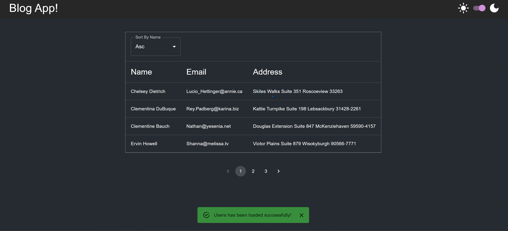
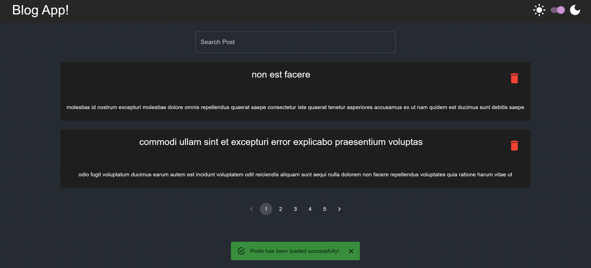

# Blog-App

## Table Of Contents
- [Blog-App](#blog-app)
  - [Table Of Contents](#table-of-contents)
  - [Introduction](#introduction)
  - [Technologies](#technologies)
  - [Installation](#installation)
    - [Client:](#client)
    - [Server:](#server)
  - [Screenshots](#screenshots)
    - [Users Page](#users-page)
    - [Posts Page](#posts-page)

## Introduction

Blog application to view users and their posts.

## Technologies

* [React](https://reactjs.org/) v18.2.0
* [Material - UI](https://github.com/mui/material-ui) v5.14.4
* [Axios](https://github.com/axios/axios) v1.4.0
* [React-Router-Dom](https://github.com/remix-run/react-router) v6.14.2
* [NestJS](https://github.com/nestjs/nest) v10.0.0
* [TypeORM](https://github.com/typeorm/typeorm) v0.3.17

## Installation

### Client:

Use the package manager [npm](https://www.npmjs.com/) to install Blog-App client.

```npm
git clone "https://github.com/yuvalitah/blog-app"
cd ../path/to/the/file
cd client
npm install
```
To start the project
```npm
npm start
```

### Server:

Use Docker and MySql to run the relevant container for the server.

To pull and create the MySql docker image and container run:

```
docker pull mysql
docker run -d --name mySql-cont -e MYSQL_ROOT_PASSWORD=mysql123 -p 3307:3306 mysql:latest
```

To create the relevant database run:
```
docker exec -it mySql-cont bash
mysql -uroot -p (enter your password afterwards)
CREATE DATABASE blog;
```

**Note - You may change the container and MySql settings such as the name or password, but if you do please make sure you enter the right settings on  ```server\src\common\envs\envs``` file**

After you have the relevant container running and working on your machine, you can start the server using npm:
```
cd ../path/to/the/file
cd server
npm install
npm start
```

## Screenshots

### Users Page


### Posts Page

